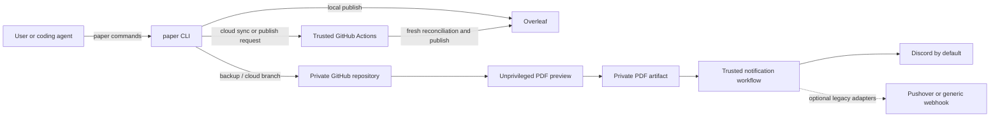

# paper-scripts

`paper` is a small command layer for writing LaTeX papers across a laptop,
Codex, GitHub, and Overleaf. You work in terms of **start**, **commit**,
**backup**, **sync**, **preview**, **notify**, and **publish**. Git branches,
remotes, CI jobs, credentials, and reconciliation rules stay implementation
details until they need attention.

The core promise is simple:

- `paper commit` makes a local checkpoint.
- `paper backup` copies committed work to GitHub and never touches Overleaf.
- `paper publish` is the explicit boundary that makes work collaborative on
  Overleaf.

## Architecture



The system is designed around five goals:

1. **One user-facing interface.** Local users and agents use `paper`; they do
   not improvise lifecycle Git commands.
2. **Explicit publication.** GitHub backup and PDF preview cannot publish to
   Overleaf.
3. **Fresh reconciliation.** Sync and publish fetch both remotes and refuse
   unsafe divergence.
4. **Narrow secrets.** Cloud agents never receive the Overleaf token or a
   notification webhook.
5. **Reviewable upgrades.** Every paper vendors a versioned runtime and
   generated workflows. `paper init` updates them conservatively.

## Repository model

A normal paper has a collaborative base branch—usually `main` or `master`—and
short-lived feature branches:

```text
overleaf/<base>    collaborative source of the paper
github/<base>      private mirror and trusted workflow source
github/<feature>   isolated work and backup
```

The base branch is discovered or configured; it is not hard-coded. A local
checkout normally has `github` and `overleaf` remotes. A cloud checkout needs
only GitHub access because privileged GitHub Actions owns Overleaf access.

Generated infrastructure inside a paper looks like this:

```text
AGENTS.md                              paper and agent instructions
.codex/config.toml                    trusted-project local Codex defaults
.paper/config.json                    non-secret paper settings
.paper/manifest.json                  generated-file version and hashes
.paper/WORKFLOW.md                     concise lifecycle contract
.paper/runtime/                        pinned paper-scripts runtime
.github/workflows/paper-preview.yml    unprivileged PDF build
.github/workflows/paper-notify.yml     trusted notifications
.github/workflows/paper-publish.yml    trusted sync/publication
notes/                                 reusable research knowledge
tasks/                                 resumable task records
```

The runtime is vendored so a CI run never downloads a moving copy of
`paper-scripts`. Updating this tooling repository does not silently change any
paper; each paper is upgraded with `paper init`, reviewed, and committed.

## Command model

| Command | Meaning |
| --- | --- |
| `paper start NAME` | Synchronize the base, create `NAME`, and immediately back it up to GitHub. |
| `paper commit "MESSAGE"` | Stage the paper repository and create a local checkpoint. Push nowhere. |
| `paper backup` | Push the current committed branch to GitHub. Never touch Overleaf. |
| `paper sync` | Reconcile GitHub and Overleaf into the local base. Run from a clean base branch. |
| `paper publish` | Reconcile fresh state, integrate committed work, back it up, and publish to Overleaf. Requires explicit authorization. |
| `paper init` | Create missing research files and install or upgrade generated infrastructure without overwriting custom content. |
| `paper-init OVERLEAF_ID OWNER/REPO [DIRECTORY]` | Create a new private GitHub/Overleaf paper and then run `paper init`. |
| `paper notify --title TITLE --message MESSAGE [--url HTTPS_URL]` | Dispatch the trusted notification workflow. The URL becomes a clickable Discord embed title. |
| `paper notify-test` | Test the configured provider through GitHub Actions. |
| `paper configure-ci [--environments-only]` | Create/verify protected environments and privately install the Overleaf credential. |
| `paper configure-notifications [--provider PROVIDER] OWNER/REPO ...` | Prompt once and configure notifications for one or more papers. Discord is the default. |
| `paper build [ROOT.tex]` / `paper clean [ROOT.tex]` | Build or clean locally with `latexmk`; default `main.tex`. |
| `paper status` / `paper doctor` | Inspect branch, remotes, divergence, configuration, and tools. |
| `paper abort` | Confirm and delete the current feature locally and on GitHub. Never touch the base or Overleaf. |
| `paper clear-experiments` | Confirm and delete all non-base branches locally and on GitHub. |
| `paper task status [--all]` / `paper task delete ID ...` | Inspect or recoverably remove task records. |

Run `paper help` for the complete command reference and `paper examples` for
compact workflows.

## Everyday local workflow

For a small edit:

```bash
paper sync
# edit and build
paper commit "Clarify the stopping-time argument"
paper publish
```

For isolated work:

```bash
paper start new-lower-bound
# edit and build
paper commit "Add the first lower-bound construction"
paper backup
# review more changes
paper publish
```

`paper start` synchronizes before creating the feature. `paper publish`
synchronizes again because collaborators may have edited Overleaf while the
feature was in progress. Successful publication returns to the base branch and
keeps the feature branch for later inspection.

## Codex and cloud workflow

`AGENTS.md` tells Codex to use the same `paper` lifecycle, to keep persistent
research knowledge separate from task checkpoints, and to notify through
`paper notify` only. The notification section is marker-managed: upgrades can
refresh that small block while preserving repository-specific instructions.

In a cloud checkout, set:

```bash
git config paper.execution cloud
```

Cloud `sync` and `publish` dispatch a workflow from GitHub's default branch and
wait for the exact run identified by a unique request ID. The workflow checks
that the reviewed branch still has the requested SHA, executes only trusted
vendored infrastructure, and rejects feature changes to `.paper/` or
`.github/`. The agent needs GitHub Contents write and Actions read/write access;
it never needs Overleaf or notification credentials.

### Codex model configuration

`paper init` generates `.codex/config.toml` with:

```toml
#:schema https://developers.openai.com/codex/config-schema.json
model = "gpt-5.6-sol"
```

`gpt-5.6-sol` is the official identifier for GPT-5.6 Sol. The project file is a
supported default for trusted repositories in the Codex desktop app, CLI, and
IDE extension. **Codex cloud chats currently do not support a repository-level
default model.** Choose Sol in the cloud model picker; the repository cannot
enforce that choice today. See the official [Codex configuration
documentation](https://developers.openai.com/codex/config-basic) and [model
guide](https://developers.openai.com/codex/models).

## Synchronization and branch safety

`start`, `sync`, and publication share the same reconciliation rules:

1. Fetch GitHub and Overleaf before changing the base.
2. Record the exact GitHub base SHA as a write lease.
3. Rebase the local base onto the fetched GitHub base.
4. Rebase that result onto the fetched Overleaf base.
5. Stop on conflicts; never silently pick a side.

Feature publication then reconciles the remote feature, rebases it onto the
fresh base, backs it up, fast-forwards the base, backs up the base, and pushes
to Overleaf. Base publication performs the corresponding base operations.

Safety properties:

- Overleaf is never force-pushed.
- Required GitHub history rewrites use an explicit lease captured before
  reconciliation; concurrent updates are rejected.
- Dirty worktrees, detached heads, and active Git operations stop lifecycle
  commands.
- A changed review SHA, build failure, conflict, timeout, or rejected push is
  never reported as successful publication.
- GitHub and Overleaf writes are not atomic. If a later write fails, inspect the
  error and rerun the normal command; do not bypass the lease.
- Generated PDFs, tokens, webhook URLs, and other credentials are never
  committed.

## PDF previews and notifications

Notifications are optional and deliberately small. Local and cloud callers use
the same provider-neutral command:

```bash
paper notify --title "Proof audit complete" \
  --message "The revised argument and checked PDF are ready." \
  --url "https://github.com/OWNER/REPOSITORY/actions/runs/RUN_ID/artifacts/ARTIFACT_ID"
```

The command dispatches the default-branch `paper-notify` workflow. Discord is
the default backend. Its rich message contains the title, body, repository name,
and an optional clickable HTTPS link. Agents never receive the webhook URL.

The preview workflow compiles the configured root document without publication
or notification secrets and uploads `paper.pdf` as a private GitHub artifact.
The trusted follow-up workflow reads only GitHub run/artifact metadata and sends
a notification linking directly to that artifact. Artifacts expire after 14
days and require GitHub sign-in. A local `output/pdf/NAME.pdf` remains a local
file; place requested PDFs there when that is the repository convention, but do
not put a local path in `--url`. Use the generated preview artifact or another
already available HTTPS artifact URL.

### Configure Discord

1. Create or select a Discord server and the text channel that should receive
   paper messages.
2. Open **Channel Settings / Edit Channel → Integrations → Webhooks → New
   Webhook**. In Discord layouts that expose webhooks at server level, use
   **Server Settings → Integrations → Webhooks → New Webhook**, then select the
   channel.
3. Give it a recognizable name such as `Paper workflow`, choose the channel,
   and select **Copy Webhook URL**.
4. Never paste the URL into a paper, chat, log, or commit. From a private terminal,
   run the following and paste it only at the hidden prompt:

   ```bash
   paper configure-notifications --provider discord \
     OWNER/PAPER_ONE OWNER/PAPER_TWO
   ```

   The helper stores `DISCORD_WEBHOOK_URL` once per repository in the protected
   `paper-notify` GitHub Actions environment and sets
   `PAPER_NOTIFY_PROVIDER=discord`. The publication workflow's notification job
   uses that same environment. A repository or organization Actions secret with
   the exact same name also resolves, but the environment secret is recommended
   because its default-branch restriction is narrower. Webhook URLs copied with
   Discord's legacy `discordapp.com` hostname are accepted and stored using the
   current `discord.com` hostname, avoiding a credential-bearing redirect.
5. Commit the generated workflows to each repository's GitHub default branch,
   run `paper configure-ci` once per paper if its environments are not already
   configured, and test with `paper notify-test`.

Discord incoming webhooks accept message content or rich embeds. This adapter
uses a single rich embed, disables mentions, rejects redirects, and validates
HTTPS links. See Discord's official [webhook API](https://docs.discord.com/developers/resources/webhook#execute-webhook)
and [webhook setup guide](https://support.discord.com/hc/en-us/articles/228383668-Intro-to-Webhooks).

### Other providers and mobile use

The provider abstraction also supports `webhook` for the existing generic JSON
payload `{title,message,url}`, `pushover` for backward compatibility, and `none`
to disable delivery. Pushover is no longer the default; it remains supported so
existing installations do not lose a working route. Provider secrets retain
their legacy names (`PAPER_NOTIFY_WEBHOOK_URL`, `PAPER_PUSHOVER_USER_KEY`, and
`PAPER_PUSHOVER_APP_TOKEN`).

For phone use, install Discord, enable notifications for the selected server and
channel, and open the private artifact link while signed in to GitHub. Nothing
else in the workflow depends on a phone.

## Initialization and upgrades

Inside an existing Git repository:

```bash
paper init
```

Infrastructure schema version 3 adds Discord, `.codex/config.toml`, and managed
agent notification instructions. The initializer is idempotent:

- missing generated files are restored;
- known, unedited generated files are upgraded using manifest hashes;
- unknown or edited generated-path collisions stop before any write;
- custom JSON fields, research notes, task records, and repository-specific
  `AGENTS.md` content are preserved;
- only the marker-managed notification block in a custom `AGENTS.md` is updated;
- version 2 `none`/`pushover` configurations migrate to the requested Discord
  default while retaining legacy Pushover device metadata;
- newer unsupported schema versions and symlinked generated paths are refused.

Review the result before committing. A typical non-secret configuration is:

```json
{
  "version": 3,
  "base_branch": "main",
  "overleaf_project_id": "YOUR_PROJECT_ID",
  "root_tex": "main.tex",
  "notify_provider": "discord",
  "pushover_device": ""
}
```

`root_tex` controls CI preview compilation. The project ID and base branch are
discovered from the Overleaf remote when possible. Custom fields are preserved.

For a new repository:

```bash
paper-init OVERLEAF_PROJECT_ID OWNER/REPOSITORY paper
```

This creates a private GitHub repository, verifies remote identities, installs
the infrastructure, and pushes initial history. It never repoints an existing
directory's remotes silently.

## Secrets and trust boundary

The generated environments are restricted to GitHub's default branch:

| Environment | Secrets | Purpose |
| --- | --- | --- |
| `paper-publish` | `OVERLEAF_TOKEN` | Fresh synchronization and explicit publication. |
| `paper-notify` | `DISCORD_WEBHOOK_URL` by default; legacy provider secret if selected | Manual, preview, and publication-result notifications. |

`paper configure-ci` creates/verifies both environments before prompting for the
Overleaf token. `paper configure-notifications` configures the selected provider
for one or many repositories. Secret input is hidden and passed directly to
GitHub; values are not printed. Private repository environments require a GitHub
plan that supports them. The tooling refuses to fall back to a broader secret
scope when that protection is unavailable.

Protect the default branch and generated infrastructure. Anyone who can modify
trusted workflow source or environment rules administers this boundary.

## Installation

The complete tooling checkout normally lives at `~/.local/bin`:

```bash
git clone https://github.com/m1gwings/paper-scripts.git ~/.local/bin
~/.local/bin/install.sh
```

Keep `paper`, `paper-init`, `lib/`, `templates/`, and `tests/` together. Copying
only the `paper` executable is not a complete installation. `install.sh` checks
dependencies and can add `~/.local/bin` to `PATH`; it does not install system
packages.

Requirements:

- Bash and Git for the local lifecycle;
- Python 3.9+ for initialization, tasks, notifications, and cloud support;
- GitHub CLI (`gh`) for cloud dispatch and protected setup;
- `latexmk` plus TeX for local builds;
- VS Code only for the optional `paper open` command.

When updating an existing checkout, inspect its status, preserve local work, and
fast-forward normally. Do not replace the directory or use destructive reset
commands to force an upgrade.

## Validation

The lightweight validation suite is:

```bash
bash -n paper paper-init install.sh
python3 -m unittest discover -s tests -v
```

It covers command behavior, synchronization rules, generated-file ownership,
cloud request matching, notification payloads, protected setup, and preview
artifact generation. Hosted delivery, GitHub plan permissions, and real Overleaf
writes remain integration checks and should use disposable or explicitly chosen
projects.
